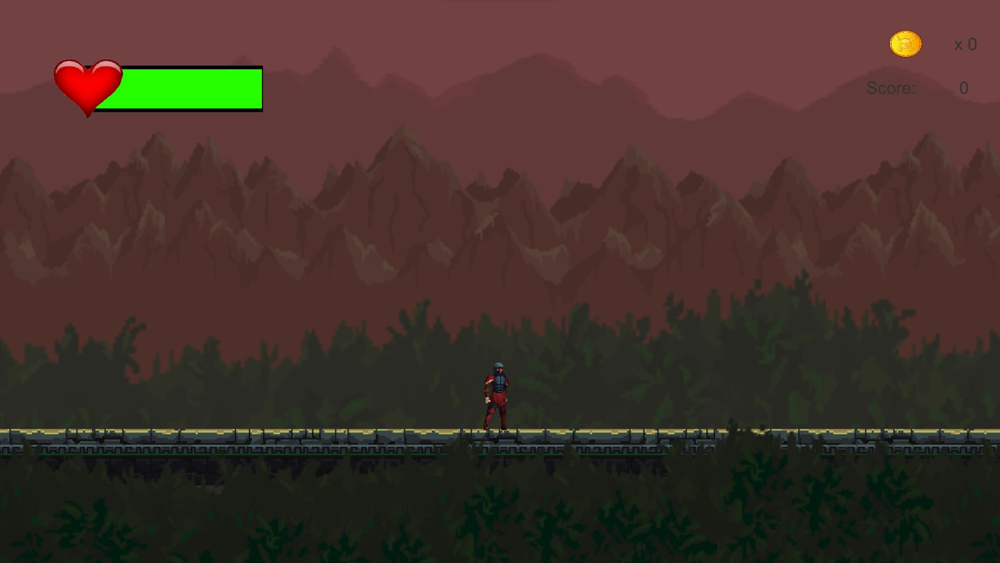

# Castle Of Uncertainties
2D Game made in Unity\

The game is set in a medieval type of setting, inspired by the Souls-like genre. It's a 2D action-rpg with a melee combat. 

Below is shown a picture of the starting scene:

